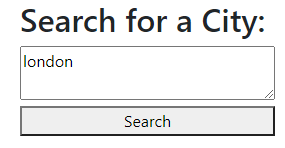
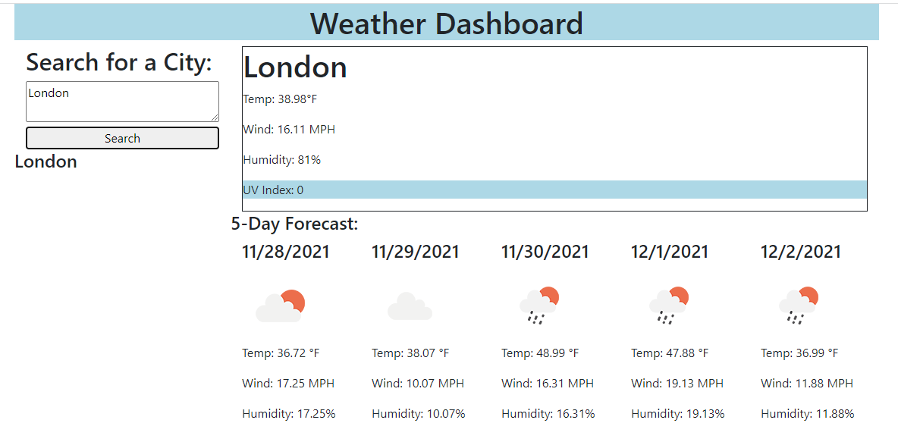

# weatherDashboard

Weather Dashboard

Description
The intent of this website is to create a dashboard showing the temperature, UV rating, wind speed and humididty of any given city, as well as the forecast for the next five days. All history of previous searches will be logged. Icons will also display the weather conditions of each day.

Usage
In the seach bar, you will enter the name of any given city and press submit to see data on the city.

https://bokok.github.io/weatherDashboard/index

Credits
Bo Kok
SMU

License
You are able to use this code as you wish.
